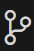
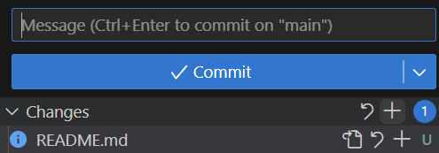

During this meeting, we go over the basics of what Git and GitHub are and how to use them. Along with this, a basic development enviornment is introduced with Microsoft Visual Studio Code

## What is Git?
*explanation in club*

## Installing
Here are some links showing how to install the software needed to participate. Everything here will work on Mac, Windows, or Linux.

Feel free to skip the install of GitHub Desktop if you're comfortable with the command line, or skip VSCode if you prefer another editor.

- [Installing VSCode](https://code.visualstudio.com/Download)
- [Installing Git](https://git-scm.com/book/en/v2/Getting-Started-Installing-Git)

## Tracking Changes with Git
In order to work with Git in VSCode, first access the menu under this icon on the left:

There will be a button labeled `Open Folder` press that and then create a new folder and choose it to use as your project's workspace. Then you should acess the vcs toolbar again, and this time press the button labeled `Initialize Repository`.

Once that's done, you're ready to begin working on the main project!

## Project Instructions
This project will be done in a series of steps, and each one should be committed individually to the repository. Committing is done under the VSCode vcs menu where, after you make any changes, you'll see a menu like this one:

To commit content:
1. Press the `+` symbol horizontal with the `Changes` dropdown to add the content to the repo tracker.
2. Type a useful message in the `Message` box relevant to your commit
3. Press the `Commit` button
That's it! At each step of the project, your changes will now be tracked in the repository.

## Project
This is a slightly modified version of the final project presented at the last meeting. broken down further into sepeerate steps. Don't worry if you can't get through all of these. There designed to 

You'll create a simple student management system in Python. Each student should have information including name, age, and courses enrolled in.

1. Create a list or dictionary to hold student information. Initialize it with some random data for a couple students. Then create a loop to get user input for a menu-driven interface. This menu should give the user options to display students or exit.
2. Create a class, `Student`, to hold the data specified \(name, age, courses\). Replace the current structure managing students with a list of `Student` types. Update the necessary code in the menu interface. (This `Student` class will behave like a C/)
3. Update the menu interface with three new options: *Add Student*, *Update Student Information*, and *Delete Student*
4. Add saving functionality. Each time the user exits, the list of student information should be saved to a file. Then, when they enter the program again, the file will be read from, attempting to initialize the student data list to the content found there.
5. Refactor your code to make it more object oriented, using setters and getters for `Studennt` and creating a new `StudentManager` class to manage the list of students. 